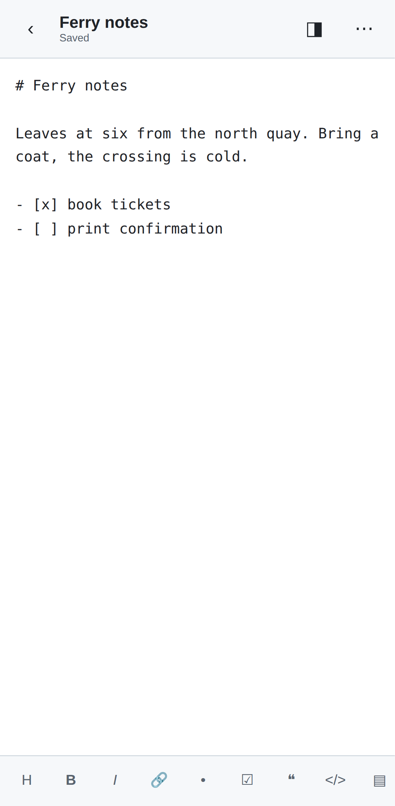

# Markdown Studio

Read and edit Markdown files — **on your phone** as an installable app, and **on
the desktop** as a Chrome extension that edits files straight from disk.

No accounts, no servers, no network. Your documents stay on your device.

<p>
  
  
  
</p>

---

## Put it on your phone

The web app is a PWA: install it once and it runs offline from your home
screen, with no computer involved. It needs to be served over HTTPS once, and
GitHub Pages does that for free — you can set it all up from the phone.

1. On GitHub open this repo → **Settings** → **Pages**
2. *Build and deployment* → Source: **Deploy from a branch** → branch **`main`**,
   folder **`/ (root)`** → **Save**
3. Wait a minute (the **Actions** tab shows the deploy), then open
   **`https://<your-user>.github.io/markdown-wizard/`** on the phone
4. **Android/Chrome:** install prompt, or ⋮ → *Add to Home screen*
   **iPhone/Safari:** Share → *Add to Home Screen*

Open it from the icon and turn on airplane mode — it works exactly the same.
That is the whole install; nothing else runs anywhere.

### Using it

- **+** new document · **↧** import `.md` files from Files, Drive or Downloads
- Autosaves about a second after you stop typing, and when you background the app
- **◨** rendered preview · **⋯** rename, share, copy, duplicate, info, delete
- `Enter` continues lists and task lists; the format bar sits above the keyboard

### One document, one copy

The reason this is not just "a notes app": every operation is defined so it
cannot leave you with `notes.md`, `notes (1).md` and `notes (2).md`.

| Operation | What happens |
|---|---|
| Type | Autosaves to the same document |
| Rename | Metadata only — the stored file is named after an id, not the title |
| Import a name you have, same bytes | Nothing. "Already in your library" |
| Import a name you have, changed bytes | Asks: **Update it** or **Keep both** |
| Duplicate | The one path to a second copy, and you have to choose it |
| Share / save a copy | Sends a `.md` out; your document stays put |

Documents live in the browser's Origin Private File System with metadata in
IndexedDB, and the app asks the browser to keep them (`navigator.storage.persist()`).

Two honest consequences: **this is not sync** — a document here is not the same
bytes as a file on your laptop, so moving one across means Import or Share. And
**clearing site data deletes them** — as does deleting the installed app on iOS,
which also evicts storage for web apps left unopened for a few weeks. Export
anything you would miss.

---

## Put it on your desktop

`extension/` is a Manifest V3 Chrome extension that edits real files on disk.

1. `chrome://extensions` → enable **Developer mode**
2. **Load unpacked** → select the `extension/` folder
3. Optional: on its details page, enable **Allow access to file URLs** so local
   `.md` files render in a tab

Then `Ctrl+Shift+M` opens the editor. It opens a single file or a whole folder,
`Ctrl+S` writes back to the original file, `Ctrl+P` jumps between files in the
folder, and any `.md` you open in a tab renders as a formatted document with an
outline. Full details in [extension/README.md](extension/README.md).

Chrome 116+. The File System Access API it relies on is desktop-only, which is
why the phone gets its own app rather than the same extension.


---

## Layout

```
markdown-wizard/
├── index.html app.js app.css sw.js manifest.webmanifest   # the web app, at the
├── lib/ icons/                                            #   root so Pages
│                                                          #   serves /<repo>/
├── extension/          # the Chrome extension, self-contained so it zips
├── shared/             # the Markdown renderer, copied into both apps
├── docs/               # screenshots
└── tools/
    ├── e2e-mobile.js       # Playwright checks, phone-emulated
    ├── e2e-extension.js    # Playwright checks, real Chromium + unpacked extension
    ├── sync-shared.sh      # copy shared/ into both apps
    └── make_icons.py       # regenerate every icon, no dependencies
```

The renderer (`shared/markdown.js`) is written from scratch and bundled rather
than fetched — Manifest V3 forbids remote code — and it escapes any HTML inside
a document instead of executing it, so opening a file you did not write is safe.

## Development

```bash
npm i -D playwright        # or a global playwright install
node tools/e2e-mobile.js
node tools/e2e-extension.js
```

The mobile suite asserts the document id list after every edit, rename, reopen,
import and delete — the "one copy" promise is the thing under test — and checks
that a `/<repo>/` deployment boots, registers its service worker and opens
offline. The extension suite loads the unpacked extension into Chromium and
covers rendering, the editing commands, the viewer and the real read/write file
paths. Both fail if a copy of the renderer drifts from `shared/`.

## License

MIT — see [LICENSE](LICENSE).
