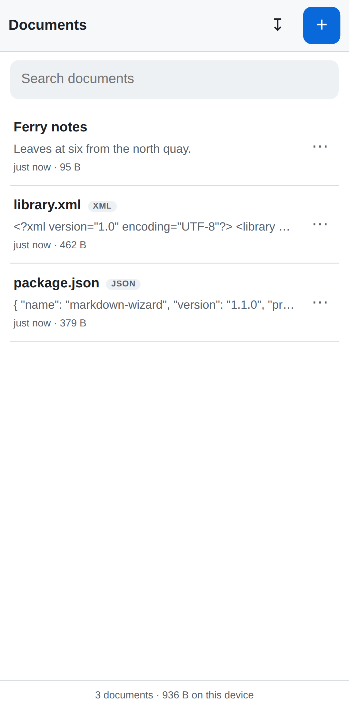
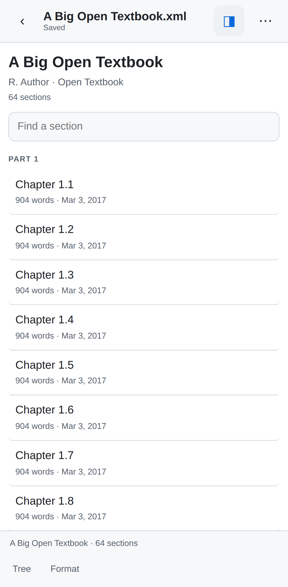
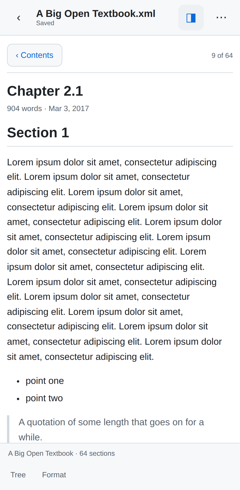
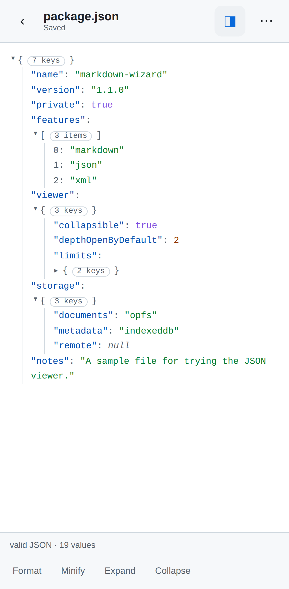
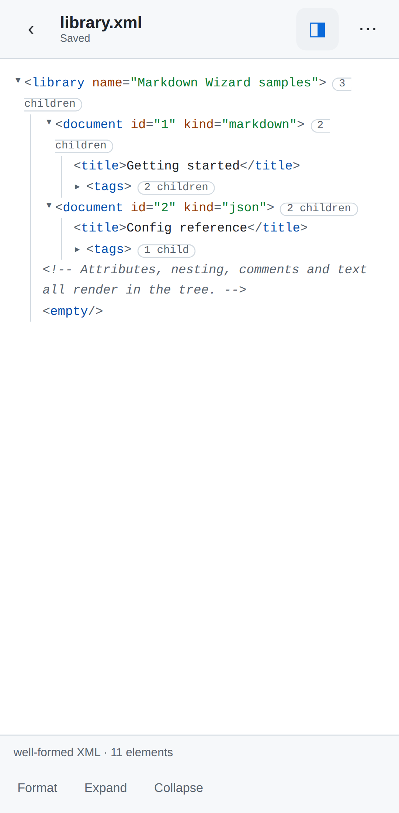

# Markdown Wizard

Read and edit **Markdown, JSON and XML** — on your phone as an installable app,
and on the desktop as a Chrome extension that edits files straight from disk.

No accounts, no servers, no network. Your documents stay on your device.

<p>
  
  
  
</p>
<p>
  
  
</p>

---

## Put it on your phone

The web app is a PWA: install it once and it runs offline from your home
screen, with no computer involved. It needs to be served over HTTPS once, and
GitHub Pages does that for free — you can set it all up from the phone.

1. On GitHub open this repo → **Settings** → **Pages**
2. *Build and deployment* → Source: **Deploy from a branch** → branch **`main`**,
   folder **`/ (root)`** → **Save**
3. Wait a minute (the **Actions** tab shows the deploy), then open
   **`https://<your-user>.github.io/markdown-wizard/`** on the phone
4. **Android/Chrome:** install prompt, or ⋮ → *Add to Home screen*
   **iPhone/Safari:** Share → *Add to Home Screen*

Open it from the icon and turn on airplane mode — it works exactly the same.
That is the whole install; nothing else runs anywhere.

### Using it

- **+** new document · **↧** import `.md`, `.json` or `.xml` files from Files,
  Drive or Downloads
- Autosaves about a second after you stop typing, and when you background the app
- **◨** rendered preview · **⋯** rename, share, copy, duplicate, info, delete
- `Enter` continues lists and task lists; the format bar sits above the keyboard

### Three kinds of document

The app picks the right view from the file's extension, falling back to reading
the content when a name says nothing.

| | Markdown | JSON | XML |
|---|---|---|---|
| Preview | rendered prose | collapsible tree | collapsible tree |
| Toolbar | headings, bold, lists… | Format, Minify, Expand, Collapse | Format, Expand, Collapse |
| While typing | — | tells you it is valid, or **the exact line and column that broke** | tells you it is well-formed |

Creating a document whose name ends in `.json` or `.xml` starts it in that
format; anything else is Markdown. Sharing exports with the right extension.

### Books hidden inside XML

Some XML is not data to inspect — it is a book. A WordPress or Pressbooks
export (WXR) carries chapters as `<item>` elements typed `front-matter`,
`part`, `chapter` and `back-matter`, ordered by `wp:menu_order`, nested by
`wp:post_parent`, with the prose as HTML inside `<content:encoded>`. As a
generic element tree that is unreadable.

So those open as a **book** instead: a table of contents grouped by part, with
word counts and dates, a filter for finding a section by name, and a page view
with Previous and Next. The raw tree is still one tap away, under **Tree**.
Plain RSS and Atom feeds get the same treatment — a list of pieces you can
read. XML that is not a book or a feed still gets the element tree.

The prose inside those chapters is HTML written by someone else, so it is
rebuilt node by node against an allowlist: scripts, frames, embedded objects,
event handlers and `javascript:` URLs never survive, and anything unrecognised
is unwrapped so its words are kept. There are tests that assert exactly that.

**Images.** An export catalogues its own media: every picture has an
`attachment` record naming the address it really lives at. Chapters, meanwhile,
often cite images by bare filename. So a chapter's images are looked up in that
catalogue first — by name, ignoring the `-300x200` suffix WordPress adds to
generated sizes — and only then resolved as a URL, against the book's own
address (`wp:base_blog_url`, or the chapter's own `<link>`). An image borrowed
from another site is left exactly as written. `http://` image URLs are lifted to
`https://`, since a page served over https silently refuses them otherwise.

If an image 404s anyway, the same file is looked for where a re-platformed site
would keep it. WordPress sites move their uploads: an export from 2017 can name
`/<subsite>/wp-content/uploads/…` while the site today serves `/app/uploads/…`,
so every URL in the file is stale although the images are all still online.
Bedrock's layout (which Pressbooks moved to) and plain multisite's network root
are both tried, each only after the previous fails.

An image that still cannot be fetched — you are offline, or it is genuinely
gone — becomes a small note naming it, which you can tap to open the address
the file asked for. A book's ⋯ menu also offers **Copy image report**: what each
picture asks for and what it was turned into, which is what a missing figure
needs for diagnosis.

This is the one thing in the app that reaches out to the network; everything
else stays on the device.

JSON validity is checked by walking the grammar rather than reading the
browser's error message, because those messages carry a position for some
mistakes and quote the document back at you for others. So a stray comma is
always reported as a line and column you can go to.

### One document, one copy

The reason this is not just "a notes app": every operation is defined so it
cannot leave you with `notes.md`, `notes (1).md` and `notes (2).md`.

| Operation | What happens |
|---|---|
| Type | Autosaves to the same document |
| Rename | Metadata only — the stored file is named after an id, not the title |
| Import a name you have, same bytes | Nothing. "Already in your library" |
| Import a name you have, changed bytes | Asks: **Update it** or **Keep both** |
| Duplicate | The one path to a second copy, and you have to choose it |
| Share / save a copy | Sends a `.md` out; your document stays put |

Documents live in the browser's Origin Private File System with metadata in
IndexedDB, and the app asks the browser to keep them (`navigator.storage.persist()`).

Two honest consequences: **this is not sync** — a document here is not the same
bytes as a file on your laptop, so moving one across means Import or Share. And
**clearing site data deletes them** — as does deleting the installed app on iOS,
which also evicts storage for web apps left unopened for a few weeks. Export
anything you would miss.

---

## Put it on your desktop

`extension/` is a Manifest V3 Chrome extension that edits real files on disk.

1. `chrome://extensions` → enable **Developer mode**
2. **Load unpacked** → select the `extension/` folder
3. Optional: on its details page, enable **Allow access to file URLs** so local
   `.md` files render in a tab

Then `Ctrl+Shift+M` opens the editor. It opens a single file or a whole folder,
`Ctrl+S` writes back to the original file, `Ctrl+P` jumps between files in the
folder, and any `.md`, `.json` or `.xml` you open in a tab renders as a formatted
document — prose with an outline, or a collapsible tree with Expand and Collapse.
The ⋯ menu formats and minifies data files in place. Full details in
[extension/README.md](extension/README.md).

Chrome 116+. The File System Access API it relies on is desktop-only, which is
why the phone gets its own app rather than the same extension.


---

## Layout

```
markdown-wizard/
├── index.html app.js app.css sw.js manifest.webmanifest   # the web app, at the
├── lib/ icons/                                            #   root so Pages
│                                                          #   serves /<repo>/
├── extension/          # the Chrome extension, self-contained so it zips
├── shared/             # the renderers (Markdown, JSON, XML, books), copied into both
├── docs/               # screenshots
└── tools/
    ├── e2e-mobile.js       # Playwright checks, phone-emulated
    ├── e2e-extension.js    # Playwright checks, real Chromium + unpacked extension
    ├── sync-shared.sh      # copy shared/ into both apps
    └── make_icons.py       # regenerate every icon, no dependencies
```

The renderers (`shared/markdown.js`, `shared/structured.js`, `shared/book.js`)
are written from scratch and bundled rather than fetched — Manifest V3 forbids
remote code. The Markdown renderer escapes any HTML inside a document instead of
executing it, the JSON and XML viewers build real DOM nodes rather than markup,
and the book reader rebuilds chapter HTML against an allowlist, so opening a
file you did not write cannot run anything.

## Development

```bash
npm i -D playwright        # or a global playwright install
node tools/e2e-mobile.js
node tools/e2e-extension.js
```

The mobile suite asserts the document id list after every edit, rename, reopen,
import and delete — the "one copy" promise is the thing under test — and checks
that a `/<repo>/` deployment boots, registers its service worker and opens
offline. The extension suite loads the unpacked extension into Chromium and
covers rendering, the editing commands, the viewer and the real read/write file
paths, including XML served as `application/xml`, where Chrome's own viewer runs
and the source has to be recovered from it. Both suites check the JSON and XML
renderers against valid, invalid and awkward-but-legal documents, and both fail
if a copy of a renderer drifts from `shared/`.

## License

MIT — see [LICENSE](LICENSE).
