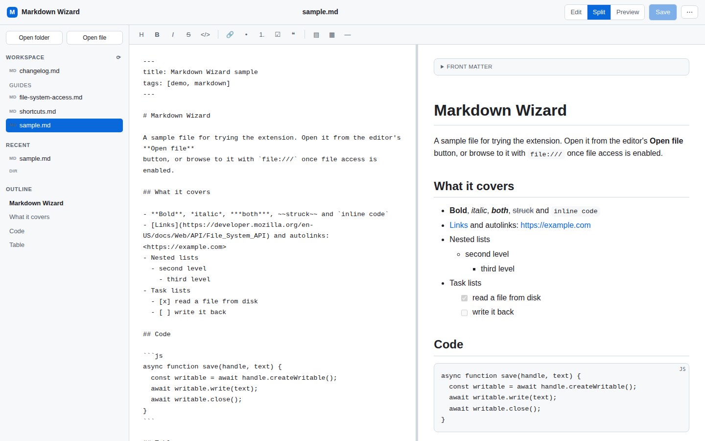

# Markdown Wizard — the Chrome extension

Open a real file (or a whole folder) from disk, edit it, and save straight back
to the original file. Handles Markdown, JSON and XML. No server, no sync, no
account — the files never leave your machine.

For the phone app, see the [repository README](../README.md).



## What it does

**Read**

- Any `.md`, `.markdown`, `.mdown`, `.mkd` or `.mdx` file you open in a tab renders
  as a formatted document instead of raw text — local `file:///` paths included.
- `.json` and `.xml` files (and `.geojson`, `.svg`, `.rss`, `.atom`, `.plist`…)
  render as a collapsible tree with Expand all / Collapse all, a validity
  verdict, and the raw source one keypress away.
- Outline sidebar that tracks the section you are reading, source/rendered toggle
  (`v`), copy source (`c` via the button), and one keypress into the editor (`e`).

**Edit**

- Open a single file or a whole folder. The folder becomes a workspace with a
  file list and `Ctrl+P` quick-open.
- Split view with live preview, formatting toolbar, and Markdown-aware typing:
  `Enter` continues lists and task lists (and ends them on an empty item),
  `Tab` / `Shift+Tab` indent and outdent.
- `Ctrl+S` writes back to the original file on disk. Optional autosave.
- JSON and XML documents swap the Markdown toolbar for a data view, report
  validity in the status bar, and can be formatted or minified from the ⋯ menu.
- Files you open are remembered between browser restarts, so the sidebar picks up
  where you left off.
- If a file changes on disk while it is open, a clean buffer reloads itself and a
  buffer with unsaved edits gets a banner instead of being clobbered.
- Export the rendered document as a standalone HTML file, or copy the HTML.

Everything renders through a Markdown parser bundled with the extension
(`src/lib/markdown.js`). Manifest V3 forbids remote code, so there is no CDN
dependency — and raw HTML inside a document is escaped rather than executed,
which makes opening a file you did not write safe.

## Install (unpacked)

1. `git clone` this repo (or download it).
2. Open `chrome://extensions` and turn on **Developer mode**.
3. Click **Load unpacked** and select this `extension/` folder.
4. To render local files, open the extension's details page and turn on
   **Allow access to file URLs**. The popup links straight there and tells you
   when it is off.

Chrome 116 or newer. Chromium-based browsers with the File System Access API
(Edge, Brave, Opera) work the same way; Firefox and Safari do not implement it.

## Using it

| Action | How |
|---|---|
| Open the editor | Toolbar icon → **Open editor**, or `Ctrl+Shift+M` |
| Open a file / folder | Sidebar buttons, `Ctrl+O`, or drag a file onto the window |
| Save | `Ctrl+S` (`Ctrl+Shift+S` for Save as) |
| Jump to a file in the folder | `Ctrl+P` |
| Edit / Split / Preview | `Ctrl+1` / `Ctrl+2` / `Ctrl+3` |
| Bold, italic, code, link, heading | `Ctrl+B`, `Ctrl+I`, `Ctrl+E`, `Ctrl+K`, `Ctrl+H` |
| Read a rendered `.md` page | Just open the file; press `v`, `o`, `e` in the page |

The first save to a given file (or folder) raises Chrome's own permission
prompt. Grant it once and the handle keeps working, including after a restart.

## Permissions, and why

| Permission | Reason |
|---|---|
| `storage` | Preferences, plus the IndexedDB entry that remembers recent files |
| `contextMenus` | The right-click entries |
| `activeTab`, `scripting` | Reads the current tab's Markdown when you click **Edit this page** |
| Host access to `*.md` URLs and `file:///` | Renders Markdown files you open in a tab |

There is no network access anywhere in the extension: no analytics, no fetches,
no remote scripts.

## Limits worth knowing

- A file opened from a `file:///` tab through **Edit** arrives as text, not as a
  writable handle — Chrome does not hand those out. Use **Save as** once, or open
  the file from the editor's own picker to get read/write on the original.
- Folder scanning skips `node_modules`, `dist`, `build`, `.git` and similar, stops
  at six levels deep, and lists at most 2000 files.
- The preview escapes embedded HTML rather than rendering it, so a document that
  relies on inline HTML shows that markup as text.

## Development

```
extension/
├── manifest.json
├── sample.md                 # a document to test against
├── icons/                    # generated by ../tools/make_icons.py
└── src/
    ├── background.js         # service worker: editor tab, context menu, handoffs
    ├── lib/
    │   ├── markdown.js       # renderer, copied from ../shared by ../tools/sync-shared.sh
    │   ├── markdown.css      # rendered-document styles, shared by viewer + editor
    │   └── store.js          # IndexedDB handle store + preferences
    ├── editor/               # the editor workbench
    ├── viewer/               # content script that renders .md pages
    └── popup/
```

Run the checks from the repository root:

```bash
npm i -D playwright   # or use a global playwright install
node tools/e2e-extension.js
```

They load the unpacked extension into Chromium and cover rendering, the editing
commands, the page viewer, and the read/write file paths (exercised through OPFS
handles, since native file pickers cannot be driven from a test). They also fail
if `src/lib/markdown.*` drifts from `../shared/`.

## License

MIT — see [LICENSE](../LICENSE).
